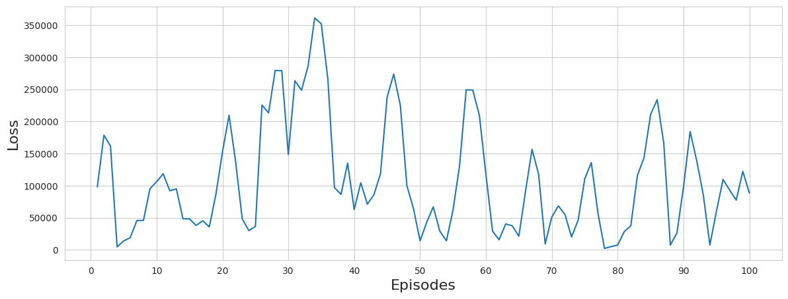
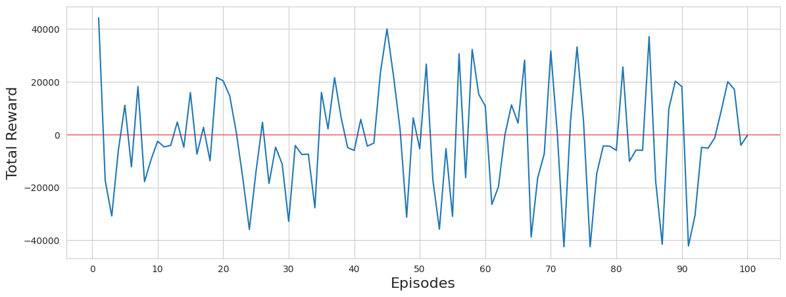

# Stock-Trading-with-Deep-Reinforcement-Learning

-- Yuanshan Zhang, Mengxin Zhao, Jinke Han
[github](https://github.com/olaf-ys/Stock-Trading-with-Deep-Reinforcement-Learning)

## Install requirements

- yfinance
- ta
- plotly

```bash
pip install -r requirements.txt
```

## Introduction

Reinforcement learning is the state of the art and most current AI research is focused on RL. It also succeeded in many real-world applications such as auto-driving, the well-known Alpha Go, strategic gaming, as well as stock trading. It is substantially different from supervised and unsupervised learning and is regarded as the �third category of machine learning� because, in reinforcement learning, the agent learns by interacting with the environment.


DQN (Deep Q Network) is a combination of model-free reinforcement learning and deep neural networks. DQN is suitable for tasks with large or continuous state or action space or when environment dynamics are indeterministic (the reason for being a model-free algorithm). Therefore, using the action value function $Q(s,a)$ enables the algorithm to learn the best policy directly from the action without the necessity of the full knowledge of the environment dynamics. 

DQN is, therefore, suitable in trading scenarios since the state space is large (the stock market is changing every second) and the full knowledge of the environment dynamics is impossible to gain (no one knows what tomorrow� stock market will look like).


## What I did

First, I define the following terminologies according to the stock trading scenario:

- Agent: the algorithm that can be trained to choose the optimal actions at each state to maximize the total rewards
- Environment: a stock trading simulation with which the agent can interact
- A (Action): hold, buy, and sell
- R (Reward): positive R when profit > 0, negative R when profit < 0
- S (State): stock info (given by a sliding window), balance, position, profits
- $Q(s,a)$: the expected return of taking action $a$ at state $s$
- Episode: $S_0, A_0, R_1, S_1, A_1, R_2, \ldots, S_t, A_t, R_{t+1}, \ldots, S_{T-1}, A_{T-1}, R_T, S_T$
- Transition Quintuple: 5 essential elements to calculate Q, expressed as $(s', a, r, s, done)$

The building of the DQN model consists of 5 major parts: 1. Environment  2. LSTM model 3. Replay Memory 4. Agent 5. Trainer

**1. Environment**\
An environment is built using the OpenAI gym to simulate stock trading. The environment consists of 3 crucial methods: 1. reset() 2. get_observation() 3. step() 4. render()

- the reset method restores the environment to the initial state at the beginning of a new episode
- the get_observation method concatenates the state information
- the step method assigns rewards and returns 3 components of the transition quintuple: next_state, reward, and done (if an episode is done or not). The render method renders real-time information to the screen

The functionality of the environment was tested using a subset of the data (see notebook for details)

**2. Model**\
An LSTM (Long Short Term Memory) is used to estimate the Q function (expressed as Q_expected in the code) by using the current state as input. However, as mentioned above, since the environment dynamics are indeterministic, the ground truth of Q function (expressed as Q_target in the code) can only be approximated. In reinforcement learning, approximating the target is called �bootstrapping�. Q_target is bootstrapped using the same network but with the next state as input and less frequent network parameters updates.

**3. Replay Memory**\
Since we are now approximating the Q with the LSTM, updating the weights for a state-action pair will affect the output of other states as well. When training NNs using stochastic gradient descent for a supervised task (for example, a classification task), we use multiple epochs to iterate through the training data multiple times until it converges. This is not feasible in Q-learning, since the episodes will change during the training, and as a result, some states that were visited in the early stages of training will become less likely to be visited later.

Furthermore, another problem is that when we train an NN, we assume that the training examples are IID (independently and identically distributed). However, the samples taken from an episode of the agent are not IID, as they obviously form a sequence of transitions.

To solve these issues, as the agent interacts with the environment and generates a transition quintuple, we store a large (but finite) number of such transitions in a memory buffer, often called replay memory. After each new interaction (that is, the agent selects an action and executes it in the environment), the resulting new transition quintuple is appended to the memory.

To keep the size of the memory bound, the oldest transition will be removed from the memory. Then, a mini-batch of examples is randomly selected from the memory buffer, which will be used for computing the loss and updating the network parameters.


**4. Agent**\
The agent estimates the Q values for each action at each state using the trained LSTM model and chooses the action with the highest Q value. Moreover, to let the agent fully explore different strategies during the early stages of episodes in the training process, $\epsilon$-greedy policy is applied, giving non-optimal actions small chances to be chosen by the agent, and the chances decrease with time. However, the agent will only take deterministic actions (i.e. not using $\epsilon$-greedy policy) on the test data.

**5. Trainer**\
First, the trainer estimates Q_expected and Q_target through the LSTM:

```python
Q_expected = self.agent.model(states).gather(1, actions).squeeze() 
Q_next = self.agent.model(next_states).detach().max(1)[0]
Q_target = rewards + (self.gamma * Q_next * (1 - dones))
```

Then, it calculates loss, $L = \underset{traget} {\Big(\big(r+\gamma \max Q(s', a', w)\big)}  - \underset{output} {Q(s, a, w)\Big)^2}$, and updates gradients via backpropagation.

## Results

Due to limited time and resources, I only ran 100 episodes and the experiment result is as follows: 





We can see that the loss and total reward barely converge after 100 episodes, which is quite reasonable since there are so many uncertainties in the stock market, and it usually requires thousands of episodes for the model to start showing signs of stability and convergence.

Although the model did not converge, the agent successfully made a $3996.9793 profit on the test data. The reason behind the controversy is that since the agent only chooses the action with the highest Q value on the test data, it is almost guaranteed that the agent will perform better on the test data. Additionally, the fact that the agent is making profits may be coincidental, given the significant fluctuations in training loss and total rewards. For instance, while the model was winning in the 100th episode, it was losing in the 99th episode.
